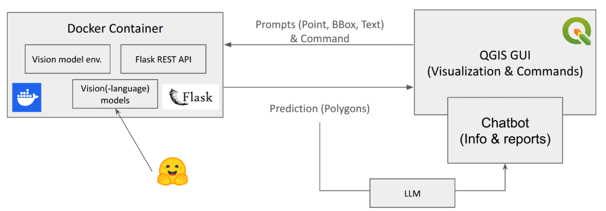

# Summary
`EasyEarth` is an open-source Python-based tool that enables users to apply state-of-the-art vision(-language) models directly to Earth observation data without writing any code. Through an intuitive QGIS plugin interface and a scalable server-side backend, `EasyEarth` empowers geospatial researchers and practitioners to interactively identify and segment objects from satellite and aerial imagery within a familiar GIS environment.

# Statement of Need
While powerful pre-trained vision(-language) models such as SAM [@kirillov2023segany] are aiding geospatial analysis, applying these models often requires programming expertise, specialized environments, and complex integration pipelines. `EasyEarth` lowers this barrier by offering seamless QGIS integration backed by a flexible, Docker-enabled inference engine. Users can run segmentation or detection workflows through point, box, or text prompts, making advanced model applications accessible to a broader audience in environmental science, remote sensing, and geography.

In particular, `EasyEarth` addresses one of the major challenges in Earth observation: the inefficiency of annotation processes. Existing tools, such as GeoSAM [@zhao_zhuoyi_2023_8191039], have provided useful first steps by enabling training label generation with SAM. However, they remain limited to a single pre-trained model, require a two-step workflow of creating image embeddings and generating labels with prompts, and demand direct modification of base Python libraries in QGIS, which can be an insecure approach that risks destabilizing the software environment. `EasyEarth` overcomes these constraints by offering a more flexible, secure, and model-agnostic framework that integrates smoothly into QGIS without compromising its stability.

# Implementation and Architecture
`EasyEarth` contains two major components, a server-side Flask application and a QGIS plugin GUI (\autoref{fig:architecture}).

The server-side Flask application is deployable via Docker (preferred for scalability) or via local execution without Docker. It handles model inference and request routing. The interactive model execution is powered by the QGIS plugin GUI, an environment that is already familiarized by geospatial researchers and practitioners. The plugin (\autoref{fig:output}) orchestrates a workflow that includes selecting imagery, choosing pre-trained models such as SAM [@kirillov2023segany] or forest canopy models [@veitchmichaelis2024oamtcd], drawing point or box prompts on the map or entering text prompts, submitting inference requests, and visualizing, editing, or storing results.

The GitHub repository of `EasyEarth` contains extensive documentation covering installation, API usage, developer contributions, and troubleshooting.

{ width=90% }

[//]: # (![QGIS Plugin GUI. \label{fig:gui}]&#40;assets/gui.png&#41;{ width=40% })

# Current List of Supported Models
`EasyEarth` currently supports a range of pre-trained vision(-language) models from Hugging Face or Ultralytics that can be applied directly within QGIS (autoref{tab:model-list}). These include prompt-based segmentation (points, boxes, and text) and semantic segmentation models.

| Model Name                                              | Platform                   | Description                             | Prompt Type | Prompt Data           |
|---------------------------------------------------------|----------------------------|-----------------------------------------|-------------|-----------------------|
| SAM [@kirillov2023segany]                               | Hugging Face               | Segment Anything                        | Point       | [[x, y], [x, y], ...] |
| SAM [@kirillov2023segany]                               | Hugging Face               | Segment Anything                        | Box         | [[x1, y1, x2, y2]]    |
| SAM2 [@ravi2024sam2]                                    | Ultralytics                | Segment Anything 2                      | Point       | [[x, y], [x, y], ...] |
| SAM2 [@ravi2024sam2]                                    | Ultralytics                | Segment Anything 2                      | Box         | [[x1, y1, x2, y2]]    |
| LangSAM [@medeiros2024langsegmentanything]              | Hugging Face & Ultralytics | SAM or SAM 2 with text prompt           | Text        | ["text1", "text2"]    |
| restor/tcd-segformer-mit-b2 [@veitchmichaelis2024oamtcd] | Hugging Face               | Semantic Segmentation for forest canopy | None        | []                    | 
: Table 1: List of current vision-language models enabled in `EasyEarth`. \label{tab:model-list}

# Planned Features
Future development of `EasyEarth` will focus on expanding usability and interpretability. A Model Manager is planned to support versioning, registration, and streamlined deployment of both pre-trained models from platforms such as Hugging Face and local custom models, making it easier for users to manage, configure, and switch between different model. In addition, a chatbot assistant will be integrated to help users interpret results, such as summarizing detected changes, explaining segmentation outputs, or generating human-readable insights, thereby bridging the gap between raw model predictions and actionable geospatial knowledge.

# Examples of Research Work
`EasyEarth` has been applied in a variety of environmental monitoring and research contexts. For example, it has been used to support greenhouse segmentation from aerial imagery, enabling the rapid identification and mapping of agricultural infrastructure at scale. In forestry applications, `EasyEarth` has been employed for tree segmentation and canopy delineation, facilitating analyses of forest structure and health. These examples highlight the potential of the tool to accelerate the generation of high-quality training data and geospatial insights across domains. Future applications are expected to build upon this foundation, integrating `EasyEarth` into research workflows and contributing to publications in areas such as land use monitoring, biodiversity assessment, and climate impact studies.

# Acknowledgements
This work was supported by the FORSAID and INNO4REST projects. `EasyEarth` was inspired by several outstanding open-source initiatives, including GeoSAM [@zhao_zhuoyi_2023_8191039], SAMGeo [@Wu2023], Ollama [@ollama2025ollama], SAM [@kirillov2023segany], SAM2 [@ravi2024sam2], GroundingDino [@liu2023grounding], LangSAM [@medeiros2024langsegmentanything]. We extend our gratitude to the developers and communities behind these projects.

# References