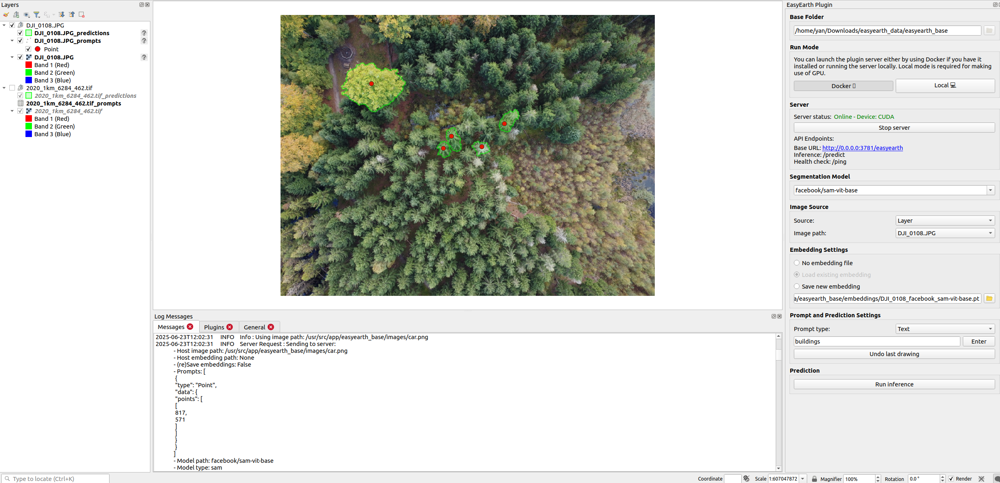

# Summary

Begin your paper with a summary of the high-level functionality of your software for a non-specialist reader. Avoid jargon in this section.

# Statement of Need

A Statement of need section that clearly illustrates the research purpose of the software and places it in the context of related work.

# Software Architecture
EasyEarth contains two major components. Server-Side Infrastructure with scalable backend to run AI models on geospatial data
and QGIS Plugin GUI with user-friendly interface to apply models inside QGIS (\label{fig:architecture})

{ width=90% }

 { width=40% }

# Current List of Vision(-Language) Models

Table 1: List of current vision-language models enabled in EasyEarth.

| Model Name                | Description | Prompt Type | Prompt Data           |
|---------------------------|-------------|----------|-----------------------|
| SAM [@kirillov2023segany] | Segment Anything Model | Point    | [[x, y], [x, y], ...] |
| SAM                       | Segment Anything Model | Box      | [[x1, y1, x2, y2]]    |
| SAM2                      | Segment Anything Model | Point    | [[x, y], [x, y], ...] |
| SAM2                      | Segment Anything Model | Box      | [[x1, y1, x2, y2]]    |
| LangSAM                   | Language Model | Text     | ["text1", "text2"]    |
| restor/tcd-segformer-mit-b2 | Semantic Segmentation | None     | []                    |

# EasyEarth Key Features

# Examples of Research Work
Mention (if applicable) a representative set of past or ongoing research projects using the software and recent scholarly publications enabled by it.

# Acknowledgements
Acknowledgement of any financial support.
FORSAID and INNO4REST

# References
A list of key references, including to other software addressing related needs. Note that the references should include full names of venues, e.g., journals and conferences, not abbreviations only understood in the context of a specific discipline.

# Citations

Citations to entries in paper.bib should be in
[rMarkdown](http://rmarkdown.rstudio.com/authoring_bibliographies_and_citations.html)
format.

If you want to cite a software repository URL (e.g. something on GitHub without a preferred
citation) then you can do it with the example BibTeX entry below for @fidgit.

For a quick reference, the following citation commands can be used:
- `@author:2001`  ->  "Author et al. (2001)"
- `[@author:2001]` -> "(Author et al., 2001)"
- `[@author1:2001; @author2:2001]` -> "(Author1 et al., 2001; Author2 et al., 2002)"

# Figures
Figures can be included like this:

and referenced from text using \autoref{fig:example}.

Figure sizes can be customized by adding an optional second parameter:
{ width=20% }
